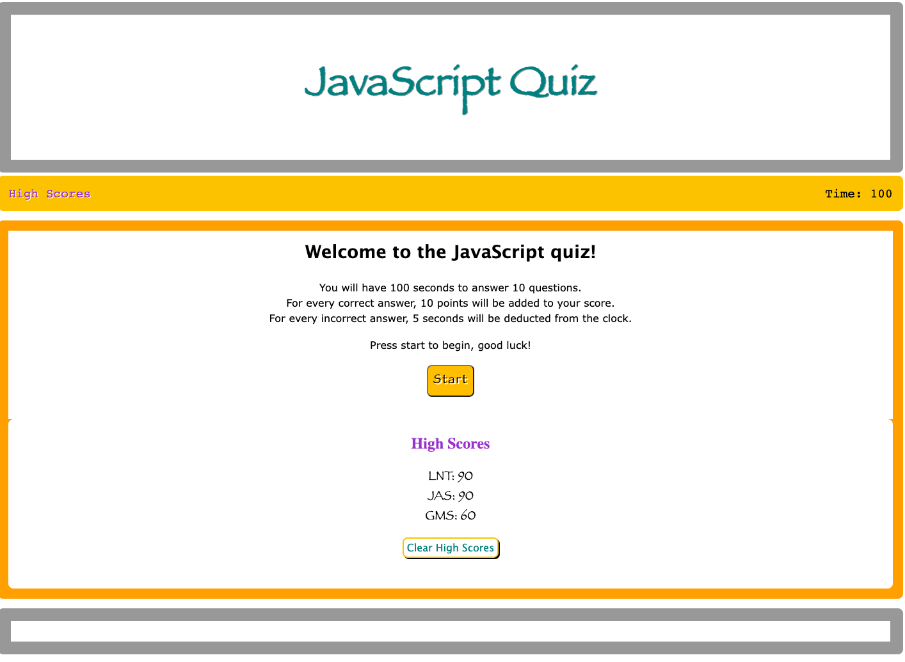
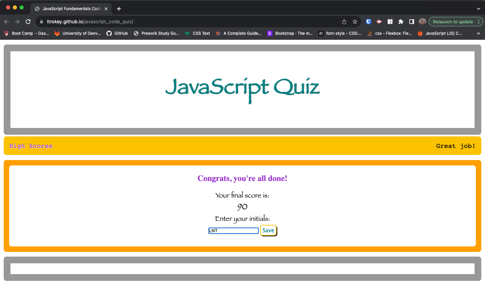

# JavaScript Fundamentals Code Quiz

[Link to live deploy](https://ltrokey.github.io/javascript_code_quiz/)

## Description

As a software developer, I embarked on a creative journey to design an engaging JavaScript quiz using the trifecta of HTML, CSS, and JavaScript. My primary motivation was twofold: to craft a visually vibrant quiz that would entertain users and, more importantly, to facilitate the learning of fundamental JavaScript concepts. Throughout this project, I encountered a few hurdles, notably grappling with web-based local storage to store user progress and struggling with the precise timing of content display. These challenges tested my problem-solving skills and deepened my understanding of web development intricacies. However, the most profound lesson I gathered from this endeavor was the boundless versatility of JavaScript, which left me in awe of its infinite possibilities for creating interactive and educational experiences.

## Installation

1. In terminal, CD into project directory.
2. Git clone password_generator_refactor_mod_3.
3. CD into new project directory.
4. Open with your text editor, for VS Code, command `code .`.

## Usage

1. Read welcome display and rules.
2. `Click` `start` button when ready to begin.
3. Read question and `Click` on one of the four choices.
4. See section next question to see if you answered the previous question correctly or incorrectly.
5. Once all questions have been answered or the time runs out, your score will appear.
6. Here the user has the option to save their score by typing in their initials and `Clicking` the `save` button.
7. The user also has the option to clear the high scores by `Clicking` the button.

## License

MIT License

Copyright (c) 2023 ltrokey

Permission is hereby granted, free of charge, to any person obtaining a copy
of this software and associated documentation files (the "Software"), to deal
in the Software without restriction, including without limitation the rights
to use, copy, modify, merge, publish, distribute, sublicense, and/or sell
copies of the Software, and to permit persons to whom the Software is
furnished to do so, subject to the following conditions:

The above copyright notice and this permission notice shall be included in all
copies or substantial portions of the Software.

THE SOFTWARE IS PROVIDED "AS IS", WITHOUT WARRANTY OF ANY KIND, EXPRESS OR
IMPLIED, INCLUDING BUT NOT LIMITED TO THE WARRANTIES OF MERCHANTABILITY,
FITNESS FOR A PARTICULAR PURPOSE AND NONINFRINGEMENT. IN NO EVENT SHALL THE
AUTHORS OR COPYRIGHT HOLDERS BE LIABLE FOR ANY CLAIM, DAMAGES OR OTHER
LIABILITY, WHETHER IN AN ACTION OF CONTRACT, TORT OR OTHERWISE, ARISING FROM,
OUT OF OR IN CONNECTION WITH THE SOFTWARE OR THE USE OR OTHER DEALINGS IN THE
SOFTWARE.

## Badges

